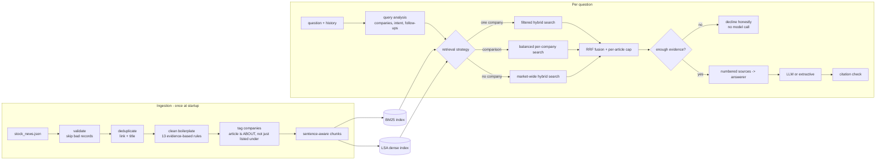

# News Chat

A chat application that answers questions about recent financial news, **grounded in and cited to** a supplied set of articles (`data/stock_news.json`: 138 records across AAPL, MSFT, AMZN, NFLX, NVDA, INTC, IBM).

It is a small retrieval-augmented (RAG) system with a real ingestion pipeline, hybrid retrieval, citation checking, a streaming web UI, and an evaluation harness. This document explains what it does, why it is designed this way, how well it works (with the caveats), and what it does not do.

---

## Quick start

```bash
python -m venv .venv && source .venv/bin/activate      # Windows: .venv\Scripts\activate
pip install -e ".[dev]"

make run            # or: python -m newschat      ->  http://127.0.0.1:8000
```

It runs with **no API key** in *extractive mode* (deterministic, offline: quotes the most relevant sentences with citations). For synthesised answers, set a key for any supported provider:

```bash
export ANTHROPIC_API_KEY=sk-ant-...     # Anthropic   (model: NEWSCHAT_ANTHROPIC_MODEL, default claude-sonnet-5)
export GEMINI_API_KEY=...               # Gemini      (model: NEWSCHAT_GEMINI_MODEL, default gemini-3.6-flash)
export OPENROUTER_API_KEY=sk-or-...     # OpenRouter  (model: NEWSCHAT_OPENROUTER_MODEL, default anthropic/claude-sonnet-5)
# optional: NEWSCHAT_LLM_PROVIDER=auto|anthropic|gemini|openrouter|extractive
```

`auto` (the default) uses the first provider with a key, in that order; naming a provider whose key is missing stops startup with a clear error. The `dev` extra installs all three provider SDKs; for a lean install pick one extra: `pip install ".[anthropic]"`, `".[gemini]"`, `".[openrouter]"`, or `".[llm]"` for all three. All providers sit behind one `LLMClient` protocol (`generation/llm.py`), so prompts, grounding and citation checks are identical whichever model answers.

Other commands: `make check` (lint + types + tests + eval gate), `make eval`, `make ablation`, `make docker-build docker-run`. Without `make` (e.g. on Windows), run the underlying commands shown in the `Makefile`. All settings are environment variables prefixed `NEWSCHAT_` (see `src/newschat/config.py` and `.env.example`).

---

## Architecture



| Layer | Package | Responsibility |
|---|---|---|
| Ingestion | `newschat.ingestion` | load/validate, dedupe, clean, tag entities, chunk |
| Retrieval | `newschat.retrieval` | tokenise, BM25, dense (LSA), RRF, query analysis, hybrid retriever |
| Generation | `newschat.generation` | source numbering, prompts, LLM clients (Anthropic, Gemini, OpenRouter), answerers, citation grounding, `ChatService` |
| API | `newschat.api` | FastAPI app (JSON + SSE), schemas, static UI |
| Evaluation | `newschat.evaluation` | golden set, metrics, runner, CLI (`newschat-eval`) |
| Composition | `newschat.bootstrap` | the only place the object graph is wired from `Settings` |

Each stage depends on an abstraction (`Embedder`, `LLMClient`, `Answerer`), so any of them can be swapped or faked. The service layer knows nothing about HTTP; the HTTP layer knows nothing about retrieval.

---

## What the data looked like (and what I did about it)

I profiled the file before designing anything. The design follows from what was actually there:

| Finding | Consequence |
|---|---|
| Only 4 fields: `title`, `link`, `ticker`, `full_text`. **No dates.** | The model is told never to invent dates or call anything "latest"; there is no time filtering. |
| 138 records become **118 unique articles** (20 duplicates: the same story under several tickers, sometimes with different URL query strings). | Dedupe by canonical URL *and* normalised title; keep the longest text; remember every feed it appeared in. |
| The `ticker` field is the **feed**, not the topic. 42 articles mention more than one tracked company; 13 are genuinely about more than one; an "Intel breakup" story sits in the AAPL feed. | Companies are detected from title/body (aliases such as "iPhone", "AWS", "Jensen Huang"). An article is *about* a company if it is in the title or mentioned repeatedly. The feed label is only a fallback (8 articles name no tracked company at all). |
| **22 paywalled or near-empty stubs**, several of which are the *answer* (e.g. "Evercore ISI Adjusts Price Target on Intel to $27 From $22"). | Kept, indexed by headline, flagged `headline_only`; the model is told to rely on them only for what the headline says. Dropping them would have made price-target questions unanswerable. |
| Boilerplate everywhere: "View Comments" (81), "Story Continues" (67), Zacks promos (13), paywall text (13), two variants of a hedge-fund newsletter pitch, Yahoo video rolls, bylines, "READ NEXT" link lists. | 13 named regex rules, each derived from a real pattern. The ingestion report counts what each rule removed (`GET /api/corpus`). About 16% of characters removed; no known markers survive (asserted in tests). |
| Off-topic items (a celebrity fashion piece, "Clinical Data Analytics Market...") filed under tickers. | They stay retrievable but rarely win; the relevance gate declines questions the corpus can't support. |

My first-pass cleaning rules missed a second variant of the newsletter pitch and trailing "READ NEXT" lists; the residual-boilerplate test caught it on the real data. That test is now permanent.

---

## Design decisions and trade-offs

**RAG rather than stuffing the corpus into the prompt.** After cleaning, the corpus is about 114K tokens, so long-context *would* fit. I chose retrieval because a typical question needs about 2K tokens of context (roughly 58x less: cheaper and faster), because it gives precise, verifiable citations, because it scales past one file, and because it lets the app *decline* deterministically when the corpus can't support an answer. I did **not** run a head-to-head against a long-context baseline (no API key in my build environment), so that trade-off is argued, not measured.

**Hybrid retrieval (BM25 + dense, fused with RRF).** Financial news is full of exact tokens (tickers, "$27", "Q4") where lexical search is strong, while users paraphrase ("chipmaker that could be broken apart"). RRF fuses the two ranked lists without calibrating BM25 scores against cosine similarities. The dense side is **LSA (TF-IDF + SVD)**, not a neural embedding: it is deterministic and needs no model download or network, so the app and its tests run anywhere. The `Embedder` protocol makes a neural model a drop-in. *Honest result: on this small corpus the dense side adds very little* (see Evaluation).

**Entity-aware query analysis, which is what actually moves the numbers.** A deterministic analyzer decides which companies a question is about and what kind of question it is, then chooses a strategy:
- *One company*: filtered search (widens automatically if the filter leaves too little).
- *Comparison*: retrieve **per company** and interleave, so one company cannot crowd out the other.
- *Follow-ups* ("What about Amazon?", "What are analysts saying about *its* price target?"): inherit the company and/or topic from earlier turns, without leaking the *old* company into the new query.

It is rules, not an LLM rewrite, on purpose: free, instant, unit-testable, and its decisions are shown to the user ("How I read your question"). The cost is weaker coverage of unusual phrasings; an LLM rewrite step is the natural upgrade.

**A two-tier relevance gate.** Coverage is the share of the question's informative terms (idf-weighted) that exist in the corpus at all. Questions naming a known company need little (0.20); unanchored questions need a lot (0.60). With a single threshold, "weather in Toronto" (one word happens to appear in one article) slipped through while "Intel rumours" was at risk of being blocked. Below the bar the service answers honestly *without calling the model*. It also reports terms that appear nowhere ("bitcoin") and passes them to the model as a hint.

**Grounding you can check.** Sources are numbered per article; the model must cite `[n]`; every citation is validated against the sources actually provided; fabricated numbers are reported (`invalid_citations`) and never returned as sources. Stale `[n]` markers are stripped from earlier assistant turns so old numbering can't confuse the model.

**Untrusted-content hardening.** Scraped text is confined to `<source>` blocks with markup escaped, so an article cannot close a block or forge a new one, and the system prompt tells the model to treat sources as data. This is defence in depth, not a guarantee: prompt injection is unsolved, and this is tested at the prompt-structure level, not against a live model.

**Extractive fallback.** With no API key the same pipeline runs end to end and quotes relevant sentences. It is a degraded mode (it quotes rather than answers, so it can be clumsy). Its real value is that the whole system is exercisable and testable offline with a *real* answerer rather than only mocks.

**Stateless API.** The client sends history with each request; the server keeps no session state. History is bounded (40 messages, 4,000 chars each) and normalised before it reaches the model.

---

## Evaluation

`evals/golden_set.json` holds **49 hand-written questions**: 20 single-company, 6 market-wide, 3 comparisons, 3 follow-ups (with history), **12 paraphrases written to avoid the article's wording**, and 5 out-of-scope. Each names the relevant articles by title prefix (resolved uniquely at load time; a dangling reference fails loudly).

```bash
make eval        # report + regression thresholds
make ablation    # component comparison below
```

| Metric (k = 5 articles) | Result |
|---|---|
| hit@5 | **1.000** |
| recall@5 | 0.975 |
| MRR | 0.935 |
| Comparison company coverage | 1.000 |
| Answer-vs-decline accuracy (49 cases) | 1.000 |

Ablation (same golden set):

| Variant | hit@5 | MRR | comparison cov. | follow-up hit / MRR | paraphrase hit / MRR |
|---|---|---|---|---|---|
| **Hybrid (BM25 + LSA)** | 1.000 | 0.935 | 1.000 | 1.00 / 1.00 | 1.00 / 0.90 |
| BM25 only | 1.000 | 0.945 | 1.000 | 1.00 / 1.00 | 1.00 / 0.89 |
| Dense (LSA) only | 0.976 | 0.897 | 1.000 | 1.00 / 1.00 | 0.92 / 0.76 |
| Hybrid, **no entity routing** | 0.976 | 0.868 | **0.833** | **0.67 / 0.23** | 1.00 / 0.85 |

What I take from this, including the parts that don't flatter the design:
- **Query analysis is the high-value component.** Removing it collapses follow-ups (MRR 1.00 to 0.23) and drops comparison coverage to 0.83.
- **Hybrid is roughly equal to BM25 here.** LSA helps paraphrases slightly (MRR 0.90 vs 0.89) and never hurts hit@5, but on a 118-article corpus lexical search is already strong. I'd expect the dense side to matter more on a larger corpus or with a neural embedder; I have not shown that.
- **These scores are optimistic.** I wrote the questions after reading the articles and the set is small. Treat it as a **regression guard** (it gates CI) and a sanity check, not an unbiased benchmark.
- **Answer quality is not evaluated by string matching.** The eval measures retrieval and the answer/decline decision. Faithfulness of LLM prose (e.g. LLM-as-judge on cited claims) is not built.

Performance on the real data (single process, no GPU): ingestion plus index build about 1.2 s at startup; analysis plus retrieval p50 about 2 ms and p95 about 4 ms per question (model latency dominates end to end).

---

## Testing

**254 tests, 99% line+branch coverage** (gate: 90%), `ruff` clean, `mypy --strict` clean on source *and* tests, with no `type: ignore` or `noqa` suppressions anywhere.

| Level | What it covers |
|---|---|
| Unit (`tests/unit`) | every stage in isolation: each cleaning rule, entity resolution, chunk bounds/overlap, dedupe, loader errors, tokenizer, BM25, dense, RRF (exact formula), query analysis incl. chained follow-ups, retriever strategies, prompt escaping, history normalisation, citation checking, both answerers, each provider client (Anthropic, Gemini, OpenRouter) against a fake SDK, provider selection, config, logging, CLI |
| Integration (`tests/integration`) | real dataset through the real HTTP stack: JSON and SSE event order, validation (422), request-ID hygiene, security headers, follow-ups, declines, and LLM failure giving a generic 502 / in-band SSE `error` with no leaked internals |
| Eval gate (`tests/evals`) | golden-set integrity plus retrieval-quality thresholds, so a ranking regression fails CI |

Beyond coverage:
- **Real-data invariants** (`TestRealDataset`): article counts, no surviving boilerplate, stubs kept and flagged, feed label is not treated as topic.
- **Mutation spot-check.** I deliberately broke eight behaviours (removed prompt escaping, disabled the relevance gate, stopped deduping, disabled citation validation, unbalanced comparisons, disabled follow-up topic inheritance, ignored the company filter, kept stale citations) and confirmed a specific test failed for each. This was a manual check, not a mutation-testing framework wired into CI.

Building the tests also found real bugs: the sentence splitter was swallowing closing quotes, and one of my RRF assertions encoded a wrong expectation (fixed by asserting the formula).

---

## API

| Endpoint | Purpose |
|---|---|
| `POST /api/chat` | `{message, history[]}` returns answer, citations, `plan` (intent/companies/follow-up), `retrieval` (coverage, uncovered terms), `invalid_citations` |
| `POST /api/chat/stream` | same, as Server-Sent Events: `meta` (plan + sources, sent first), then `delta`*, then `final` (or `error`) |
| `GET /api/corpus` | the ingestion report: what was cleaned, deduped, flagged |
| `GET /api/health` | status, answerer in use, corpus size |
| `GET /`, `/api/docs` | web UI, OpenAPI docs |

The UI renders everything with DOM APIs (never `innerHTML`) under a strict CSP (`script-src 'self'`), since model output derives from scraped text.

---

## Project layout

```
src/newschat/{ingestion,retrieval,generation,api,evaluation}/   bootstrap.py config.py domain.py
tests/{unit,integration,evals}/    evals/golden_set.json    data/stock_news.json
Dockerfile   Makefile   .github/workflows/ci.yml
```

---

## What I did not do (and would do next)

- **The LLM path has not been exercised against the live API.** I had no API key in my build environment. The Anthropic, Gemini and OpenRouter clients are tested against faked SDKs (payload shape, role mapping, streaming, error wrapping) and the prompt/grounding logic is fully tested, but I have **not** seen real model output through it. The first thing to do with a key is run the golden questions and read the answers.
- **No answer-faithfulness evaluation** (LLM-as-judge on whether cited claims are supported), and **no long-context baseline** comparison.
- **LSA rather than neural embeddings** (chosen for offline determinism; swap via `Embedder`).
- **Rule-based query analysis** will miss unusual phrasings; an LLM query-rewrite step would generalise better at the cost of latency and determinism.
- **Small, author-written golden set** (see caveat above).
- **No dates in the data**, so no recency reasoning. "Recent" only ever means "in the provided articles".
- **Single-process, in-memory index** rebuilt at startup (about a second here). Fine for this corpus; a larger one needs a persisted vector store.
- **No authentication or rate limiting**; add at the gateway before exposing publicly.
- **Environment caveats:** everything was verified on Python 3.12. The Docker image and the Python 3.10 CI leg are written but were **not built or run** (no Docker available); treat them as unverified until CI runs.
- Minor: two articles contain a mid-text "READ ALSO:" link list that the cleaner doesn't strip (no reliable end marker), and extractive mode can quote such fragments.
